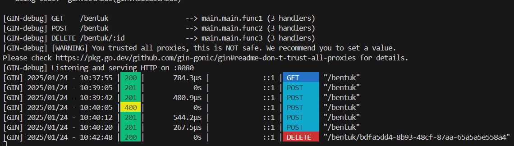
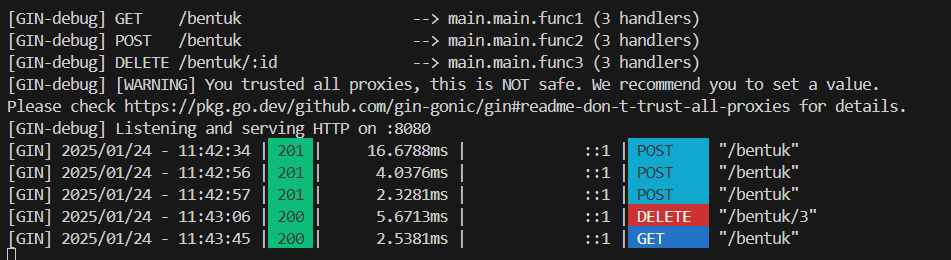

# Backend
learn back-end 

----------------------------------------------------------------
# installation
https://go.dev/dl/
-----chek install----
go version
go mod init go-modul
go get github.com/google/uuid
go get -u github.com/gin-gonic/gin
go get github.com/google/uuid
go get -u gorm.io/gorm
go get -u gorm.io/driver/sqlite
go get modernc.org/sqlite
go get github.com/joho/godotenv
go get github.com/go-playground/validator/v10
go get github.com/gin-contrib/limiter
go get github.com/swaggo/gin-swagger
go mod tidy

----------------------------------------------------------------
# Set Api Test Db
set CGO_ENABLED=1
set GOOS=windows
set GOARCH=amd64

----------------------------------------------------------------
# run app
go run main.go // [namefile.go]

----------------------------------------------------------------
# Postman Test
-rest_api-
curl -X GET http://localhost:8080/bentuk
curl -X DELETE http://localhost:8080/bentuk/bdfa5dd4-8b93-48cf-87aa-65a5a5e558a4

-api_db- 
create database "rest_api"
curl -X POST http://localhost:8080/bentuk \
-H "Content-Type: application/json" \
-d '{"jenis": "lingkaran", "parameter": 5}'

curl -X GET http://localhost:8080/bentuk
curl -X DELETE http://localhost:8080/bentuk/1

----------------------------------------------------------------
# Output: ApI 

